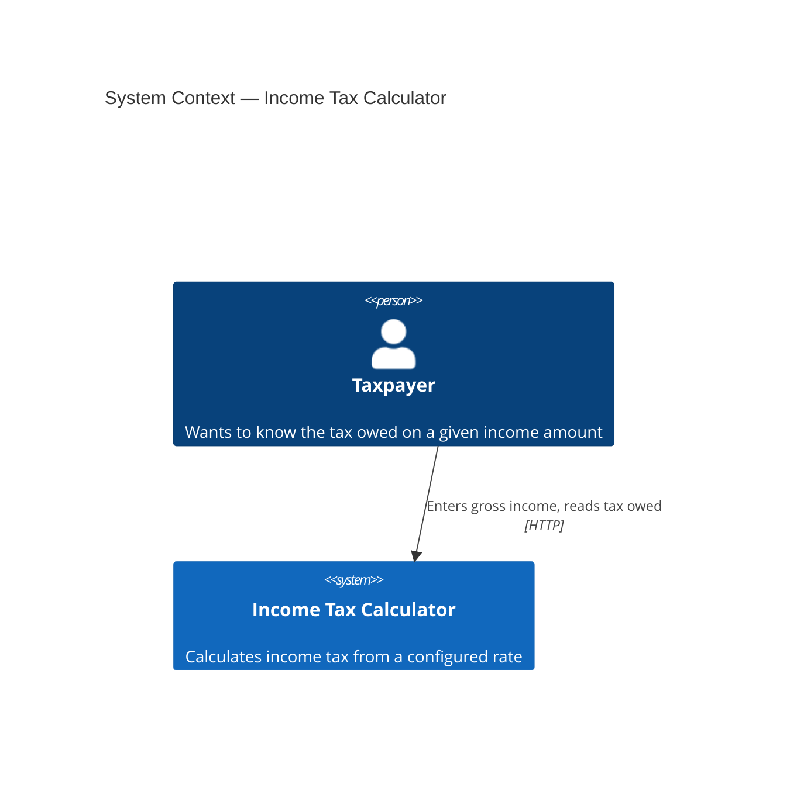
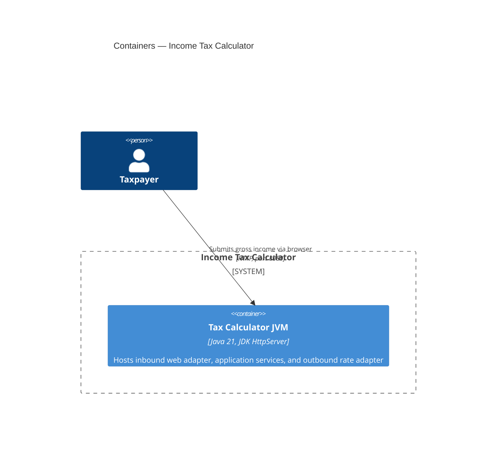
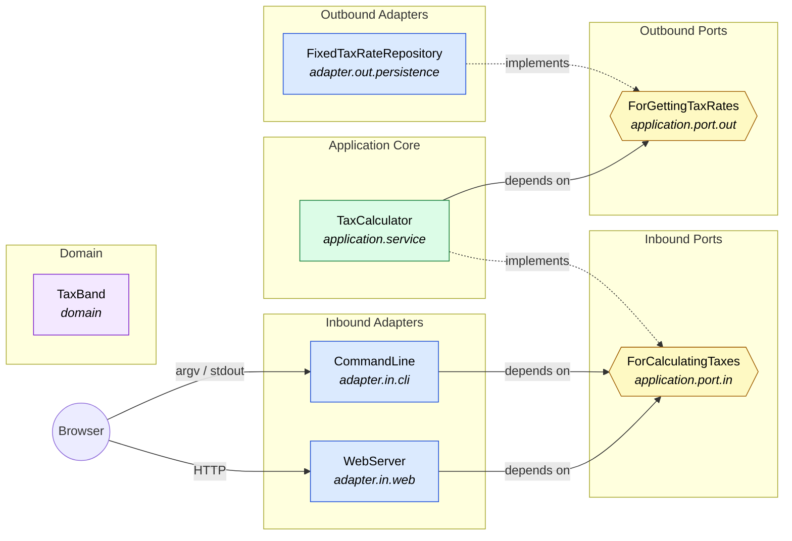
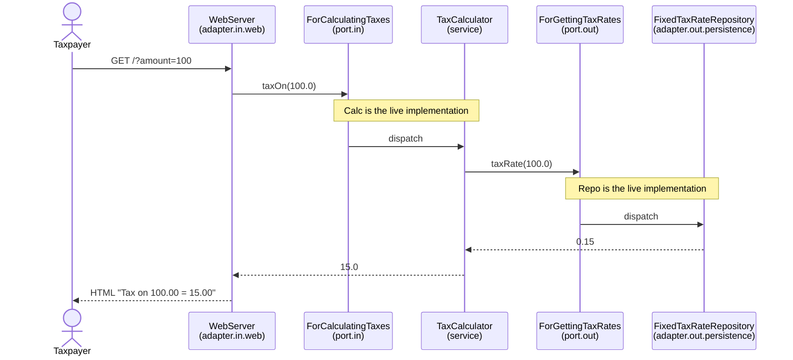

# Architecture

The Income Tax Calculator is a small Java application structured using
**hexagonal architecture** (ports & adapters).

> This codebase is a teaching example used to explore Hexagonal Architecture
> as part of Alistair Cockburn's [Heart of Agile](https://heartofagile.com/)
> workshops. Hexagonal architecture itself was [introduced by Alistair
> Cockburn in 2005](https://alistair.cockburn.us/hexagonal-architecture/).
> The application is intentionally minimal — the architectural shape is what
> the example is meant to make visible.

This document describes the system using the [C4 model](https://c4model.com/)
at three levels:

1. **Context** — the system and its users
2. **Container** — the runtime units that make up the system
3. **Component** — the application core, its ports, and its adapters

All diagrams are written in Mermaid and render directly on GitHub.

---

## Why hexagonal?

The business behaviour (how tax is calculated) is kept in a **pure application
core** that knows nothing about HTTP, persistence, or any framework. The core
defines two kinds of interface:

- **Driving (inbound) ports** — what the application offers callers.
- **Driven (outbound) ports** — what the application needs from the outside.

**Adapters** sit on the outside: inbound adapters translate external requests
(HTTP, CLI, tests) into inbound port calls; outbound adapters implement
outbound ports against real infrastructure (a database, an HTTP API, an
in-memory stub).

Dependencies always point **inward**: adapters → ports → application core →
domain. Nothing in the core ever imports anything from an adapter.

---

## Level 1 — System Context

Who uses the system, and what does it integrate with?



Today the system has no external dependencies — rates are served by an
in-process stub adapter. A future version could integrate with a tax-authority
API or a rates database; those would appear as additional external systems
here.

---

## Level 2 — Containers

What are the runtime units, and what technologies do they use?



A single JVM process, deliberately framework-free. The JDK-bundled
`com.sun.net.httpserver.HttpServer` serves the web UI; no Spring, no servlet
container.

---

## Level 3 — Components (the hexagon)

Inside the JVM, components are organised by hexagonal role.



**Reading the diagram:**

- Hexagons (`{{ }}`) are **ports** — interfaces.
- Solid arrows are **compile-time dependencies**.
- Dotted arrows (`-.implements.->`) show which class implements which port.
- All solid arrows point *inward* — adapters depend on ports, the application
  depends on ports, ports depend on the domain. The domain depends on nothing.

---

## Request flow

A typical end-to-end request:



`WebServer` never references `TaxCalculator`; `TaxCalculator` never references
`FixedTaxRateRepository`. Each side talks only to the port.

---

## Package layout

```
com.russmiles.incometax
├── App                                      # composition root + main (web)
├── CliApp                                   # composition root + main (cli)
│
├── domain
│   └── TaxBand                              # value type (no outward deps)
│
├── application
│   ├── port
│   │   ├── in
│   │   │   └── ForCalculatingTaxes          # driving port
│   │   └── out
│   │       └── ForGettingTaxRates           # driven port
│   └── service
│       └── TaxCalculator                    # implements ForCalculatingTaxes
│
└── adapter
    ├── in
    │   ├── web
    │   │   └── WebServer                    # HTTP UI → ForCalculatingTaxes
    │   └── cli
    │       └── CommandLine                  # CLI → ForCalculatingTaxes
    └── out
        └── persistence
            └── FixedTaxRateRepository       # implements ForGettingTaxRates
```

Tests mirror this layout under `src/test/java`:

```
acceptance/
├── StubTaxRateRepository                    # test-only outbound adapter
├── CalculatingIncomeTaxAcceptanceTest       # drives through the inbound port
├── CalculatingIncomeTaxViaCliAcceptanceTest # drives through the CLI adapter
└── CalculatingIncomeTaxViaWebAcceptanceTest # drives through the web adapter (real HTTP)
```

---

## Extending the system

The hexagonal structure makes it cheap to add new ways in and out:

| To add… | Create a class in… | Have it depend on… |
|---|---|---|
| ~~A CLI front-end~~ (done — see `CommandLine`) | `adapter.in.cli` | `ForCalculatingTaxes` |
| A REST/JSON API | `adapter.in.web` | `ForCalculatingTaxes` |
| Rates from a database | `adapter.out.persistence` | implement `ForGettingTaxRates` |
| Rates from HMRC's API | `adapter.out.http` (new package) | implement `ForGettingTaxRates` |

The application core and existing adapters do not need to change. Wire the new
adapter in `App.java`.
